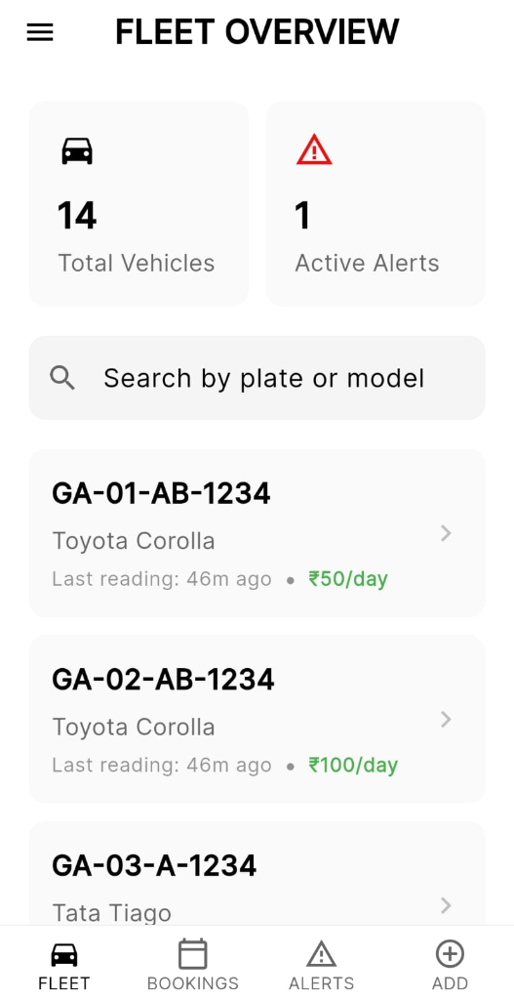
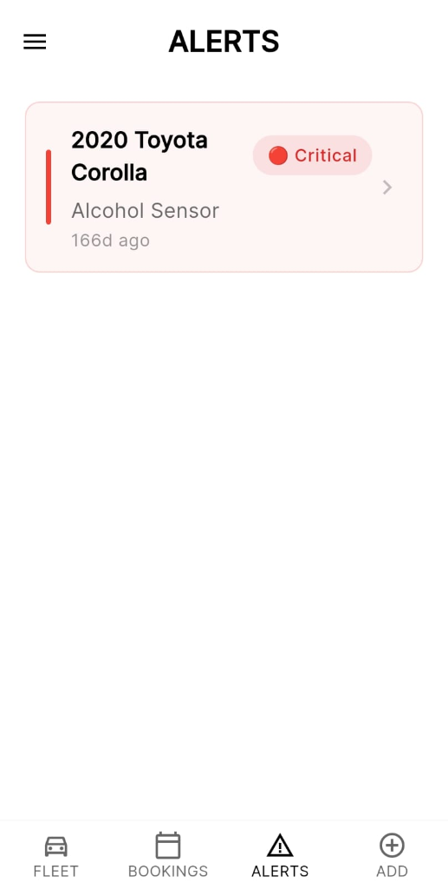
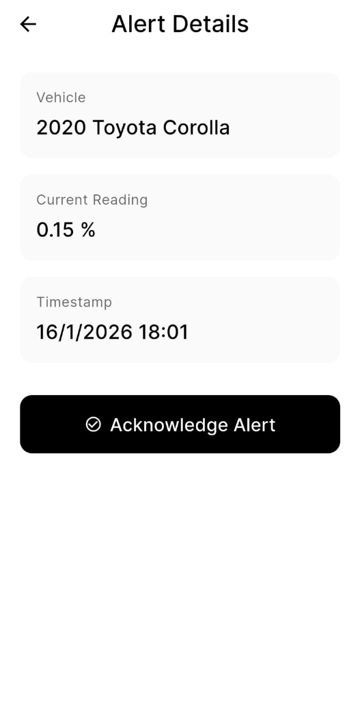
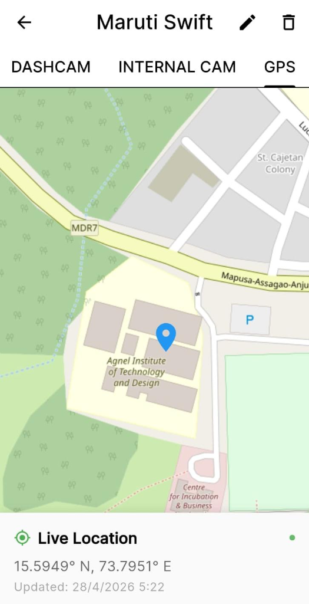
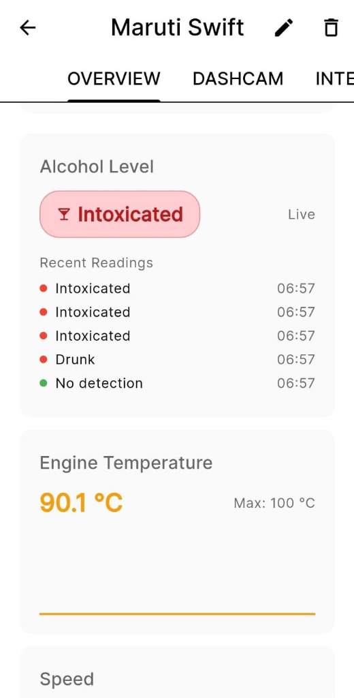
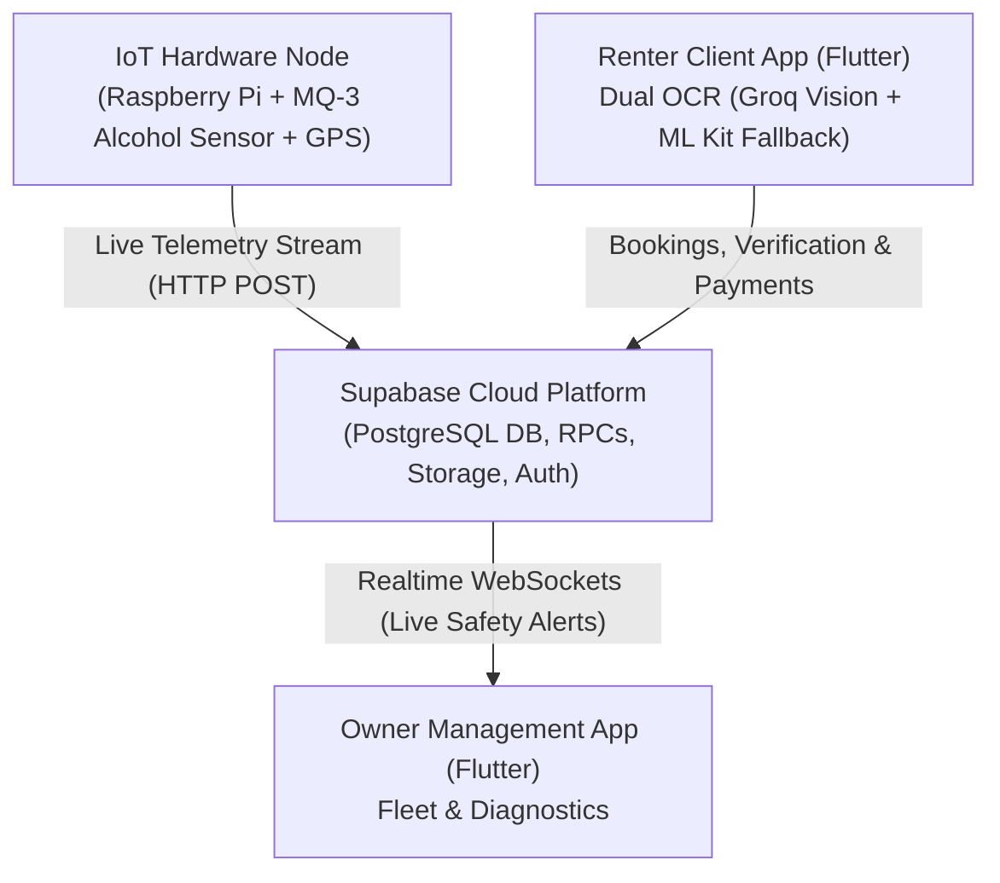

# 🚗 Rent.Goa — Service Provider App

[](https://flutter.dev)
[](https://dart.dev)
[](https://supabase.com)

An IoT-enabled, cloud-connected mobile fleet management platform designed for vehicle rental providers and fleet owners in Goa. This application allows local vehicle owners to manage fleet inventory, process booking requests, track earnings analytics, and monitor vehicle diagnostics.

---

## 📱 App Preview

| Fleet Overview | Real-Time Alerts Feed | Alert Details & Acknowledge | Real-Time GPS Tracking | Live OBD-II Diagnostics |
| :---: | :---: | :---: | :---: | :---: |
|  |  |  |  |  |

---

## 🏗️ System Architecture



---

## 🌟 Key Features

* **🚘 Fleet Inventory Management**: Add, update, publish, or unpublish vehicles with custom pricing per day, fuel types, transmission, and location assignments.
* **📅 Booking Management**: Real-time incoming rental requests dashboard with instant accept, reject, or status update workflows.
* **📊 Revenue & Earnings Analytics**: Dynamic earnings reports with horizontal quick-filter chips (`This Week`, `This Month`, `All Time`) powered by FL Chart.
* **📍 Multi-Location Management**: Interactive location picker and map management powered by `flutter_map` and `latlong2`.
* **⚠️ Diagnostic & IoT Alerts**: Real-time alert notifications for vehicle status, tamper detection, and ignition events.

---

## 🛠️ Technology Stack

* **Framework**: Flutter (Dart)
* **Backend & Database**: Supabase (PostgreSQL, Realtime, RLS Policies, Storage)
* **Maps & Geolocation**: `flutter_map`, `latlong2`
* **Charts & Analytics**: `fl_chart`
* **Authentication**: Supabase Auth (Email / Password)

---

## 📁 Project Structure

```text
lib/
├── models/         # Vehicle, Booking, Alert, ProviderLocation data models
├── screens/        # Dashboard, Fleet, Bookings, Earnings, Vehicle Detail screens
├── services/       # VehicleService, BookingService, LocationService, AlertService
├── widgets/        # EmptyState, VehicleCard, FilterChips reusable UI components
├── theme.dart      # Application design system tokens & colors
└── main.dart       # Application entry point & Supabase initialization
```

---

## 🚀 Getting Started

### Prerequisites
* [Flutter SDK](https://docs.flutter.dev/get-started/install) (`>=3.11.0`)
* Android Studio / Xcode for emulators or physical device deployment

### Installation

1. **Clone the repository**:
   ```bash
   git clone https://github.com/Zidan15/Rental_Car_Service_Provider_App.git
   cd Rental_Car_Service_Provider_App
   ```

2. **Install dependencies**:
   ```bash
   flutter pub get
   ```

3. **Configure Environment Variables**:
   Create a `.env` file in the project root:
   ```env
   SUPABASE_URL=https://your-supabase-url.supabase.co
   SUPABASE_ANON_KEY=your-supabase-anon-key
   ```

4. **Run the Application**:
   ```bash
   flutter run
   ```

---

## 📄 Author

Developed by **[Zidan15](https://github.com/Zidan15)** as part of the **Rent.Goa** Smart Vehicle Rental Platform.
